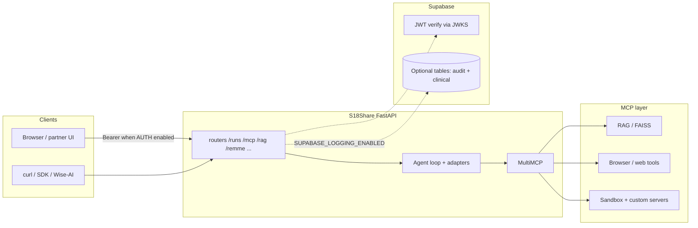

# S18Share

Open-source agent runtime and orchestration framework for AI systems.


- **Python:** 3.11+
- **Version:** 0.2.0

## The magic moment (under 30 seconds)

**One sentence:** Send a natural-language job to **`POST /runs`**, and S18 orchestrates an **agent loop** that can call **REMME memory**, **RAG**, and **MCP tools** (browser, sandbox, custom servers) behind one canonical contract, with optional Supabase JWT verification and audit logging.

**Proof in three steps:** `uv sync` -> put `GEMINI_API_KEY` in `.env` -> `uv run python api.py` -> open **`/docs`** and execute **`POST /runs`** with `{"query": "..."}`. You will see a run id and the pipeline come alive without wiring a separate orchestration framework.

**Go deeper in five minutes:** [docs/QUICKSTART_5_MIN.md](docs/QUICKSTART_5_MIN.md) (git clone → running agent, Swagger UI as the built-in front end).

## Why it exists

Most agent prototypes start as fragile scripts: prompts, tools, memory, scheduled jobs, and telemetry all live in different places. S18 gives those pieces a runtime boundary so teams can ship AI workflows with request contracts, state, observability, local/cloud model options, and MCP integrations without rebuilding orchestration plumbing every time.

## Core capabilities

- **Agent runtime:** multi-step planning and execution through FastAPI routes and a reusable `s18_engine` import surface.
- **Workflow-agnostic contracts:** normalize product-specific payloads into canonical `/runs` requests via integration adapters.
- **Memory and retrieval:** REMME user memory plus RAG document indexing/search.
- **MCP hub:** built-in RAG/browser/sandbox servers plus configurable external MCP servers.
- **Scheduling and automation:** cron-style jobs, skills, inbox flows, and trusted CLI harness jobs.
- **Local-first or cloud models:** profile overlays for local models alongside cloud model providers.
- **Observability:** Prometheus metrics, Docker monitoring assets, and runtime health endpoints.

## Architecture at a glance

S18 is not “a single LLM route.” The **FastAPI routers** (`/runs`, `/mcp`, `/rag`, `/remme`, …) sit in front of an **agent loop** and a **MultiMCP** layer that spawns and talks to **stdio MCP servers**. **Supabase** is the trust boundary (JWT via JWKS) and optional persistence—not a stand-in for the orchestration core.



## Start Here

If you are new to this repo, use this sequence:

1. **Install deps:** `uv sync`
2. **Set env:** copy `.env.example` to `.env`, then set `GEMINI_API_KEY`
3. **Run API:** `uv run python api.py`
4. **Verify:** open `http://localhost:8000/health` and `http://localhost:8000/docs`
5. **Run a canonical workflow:** `POST /runs` with optional integration metadata (see [5-minute quickstart](docs/QUICKSTART_5_MIN.md) for the shortest path)

Key docs for common tasks:

- **Run contract and adapter architecture:** `integrations/contracts.py`, `integrations/adapters/*`
- **Settings and runtime overrides:** `config/settings.json`, `config/settings_loader.py`
- **Wise-AI integration details:** [Wise-AI Integration Sync](#wise-ai-integration-sync-mar-2026)
- **Docker + monitoring:** [Docker](#docker), [Monitoring (Dev + Staging Baseline)](#monitoring-dev--staging-baseline)

## Audience Paths

### Developer quickstart

Use this path if you want to run code and ship features quickly.

1. Follow [Quick start](#quick-start) (deps, env, run API).
2. Send a run request using [Workflow-agnostic integrations](#workflow-agnostic-integrations-apr-2026).
3. Use [Project structure](#project-structure) to find where to change code.
4. Validate with tests in `tests/` and scripts in `scripts/`.

Primary files:

- `integrations/contracts.py`
- `integrations/adapters/*`
- `routers/runs.py`
- `config/settings_loader.py`

### Platform/operator

Use this path if you manage deployment, runtime reliability, and observability.

1. Start with [Docker](#docker) for local/staging orchestration.
2. Configure metrics/alerts via [Monitoring (Dev + Staging Baseline)](#monitoring-dev--staging-baseline).
3. Review runtime behavior in [Configuration](#configuration) (`config/settings*.json`).
4. Track auth/logging posture in [Quick start](#quick-start) -> Supabase integration contract.

Primary files:

- `docker-compose.yml`
- `monitoring/docker-compose.monitoring.yml`
- `monitoring/prometheus/`
- `config/settings.json`

### Integration partner (wise-ai)

Use this path if you are integrating S18 with wise-ai workflows/endpoints.

1. Read [Wise-AI Integration Sync (Mar 2026)](#wise-ai-integration-sync-mar-2026).
2. Set `EXTERNAL_MOCKEHR_BASE_URL` (or legacy `WISE_MOCKEHR_BASE_URL`) and verify endpoint reachability.
3. Send canonical `POST /runs` payloads with `integration_id=wiseai`, `workflow_id=cdss`.
4. Run the cross-stack verification commands in the Wise-AI section.

Primary files:

- `integrations/adapters/wiseai.py`
- `config/integrations/wiseai_cdss_v1.json`
- `tests/integrations/`

## Document Map

- [The magic moment (under 30 seconds)](#the-magic-moment-under-30-seconds)
- [Why it exists](#why-it-exists)
- [Core capabilities](#core-capabilities)
- [Architecture at a glance](#architecture-at-a-glance)
- [5-minute quickstart](docs/QUICKSTART_5_MIN.md)
- [Start Here](#start-here)
- [Audience Paths](#audience-paths)
- [Developer quickstart](#developer-quickstart)
- [Platform/operator](#platformoperator)
- [Integration partner (wise-ai)](#integration-partner-wise-ai)
- [Workflow-agnostic integrations (Apr 2026)](#workflow-agnostic-integrations-apr-2026)
- [Agnostic example workflows](#agnostic-example-workflows)
- [MCP marketplace integration](#mcp-marketplace-integration)
- [Local-first profiles](#local-first-profiles)
- [Features](#features)
- [Harness jobs (trusted CLI runner)](#harness-jobs-trusted-cli-runner)
- [A2A and AG-UI direction](#a2a-and-ag-ui-direction)
- [Quick start](#quick-start)
- [Docker](#docker)
- [Monitoring (Dev + Staging Baseline)](#monitoring-dev--staging-baseline)
- [Engineering rigor signals](#engineering-rigor-signals)
- [Project structure](#project-structure)
- [Configuration](#configuration)
- [When to use S18 vs orchestration frameworks](#when-to-use-s18-vs-orchestration-frameworks)
- [Roadmap](#roadmap)
- [Wise-AI Integration Sync (Mar 2026)](#wise-ai-integration-sync-mar-2026)
- [License](#license)

## Workflow-agnostic integrations (Apr 2026)

S18Share is designed to **decouple external product/workflow specifics from the orchestration core**. Ingress requests are normalized into a **canonical run contract**, then routed through an **integration adapter** selected by `integration_id` (or `source_system` fallback).

- **Canonical contract models:** `integrations/contracts.py`
- **Adapter interface + implementations:** `integrations/base.py`, `integrations/adapters/*`
- **Adapter registry + backward-compatible aliases:** `integrations/registry.py`
- **Productized core import surface:** `s18_engine/`
- **Config-driven integration profiles:** `config/integrations/*.json` (example: `wiseai_cdss_v1.json`)
- **Architecture deep-dive:** `docs/architecture/S18_WORKFLOW_AGNOSTIC_TARGET.md`

### Quick start: run with canonical metadata

`POST /runs` accepts optional integration metadata. If omitted, S18 falls back to the `default` adapter (`integration_id=default`, `workflow_id=generic`, `contract_version=v1`).

```bash
curl -X POST "http://localhost:8000/runs" \
  -H "Authorization: Bearer <supabase_access_token>" \
  -H "Content-Type: application/json" \
  -d '{
    "query": "interpret CBC and suggest next steps",
    "integration_id": "wiseai",
    "workflow_id": "cdss",
    "contract_version": "v1",
    "source_system": "wiseai",
    "external_event_id": "evt_123",
    "consent_ref": "consent_abc",
    "raw_payload": {"hemoglobin": 12.1, "wbc": 7.5, "platelets": 220}
  }'
```

### Add a new integration (high level)

- Implement an adapter in `integrations/adapters/<your_integration>.py` (map **raw → canonical**, and **canonical result → response envelope**).
- Add a profile `config/integrations/<integration>_<workflow>_<version>.json` for risk/response profiles and field aliases.
- Add contract/registry/adapter tests under `tests/integrations/`.

## Agnostic example workflows

These examples are intentionally non-medical to demonstrate reusable core orchestration:

- `examples/personal_finance/` - expense triage and budget actions
- `examples/travel_planner/` - itinerary and logistics planning

Run either example by sending its `run_payload.json` to `POST /runs`.

## MCP marketplace integration

S18 can operate as a central MCP hub for built-in and external servers.

- Integration guide: `docs/mcp/MCP_MARKETPLACE_INTEGRATION.md`
- Dynamic server controls: `GET /mcp/servers`, `POST /mcp/servers`, `POST /mcp/refresh/{server}`
- One-click server scaffold:

```bash
python scripts/scaffold_mcp_server.py --name weather
```

The scaffold creates a ready-to-run MCP server starter in `mcp_servers/custom/`.

## Local-first profiles

Use profile overlays to run S18 in laptop/privacy-focused modes without editing
tracked settings files. The default local path is **Ollama mode** because it is
usually faster to start and simpler for laptops. **llama.cpp mode** is available
when you want an OpenAI-compatible local server, especially on a machine where
you can run `llama-server` natively for better CPU/GPU performance than Docker.

Available profiles under `config/profiles/`:

- `local-laptop-gemma` - Ollama mode with `gemma3:4b`
- `local-laptop-qwen` - Ollama mode with Qwen models
- `local-llama-cpp` - llama.cpp mode for chat and embeddings
- `privacy-first` - Ollama-first private local profile
- `distribution-runs` - strict MCP readiness profile for `/runs` (requires `rag` + `sandbox`)

Quick toggle scripts for Docker-based local development:

```powershell
.\scripts\use-ollama.ps1
.\scripts\use-llama-cpp.ps1
```

If you run `llama-server` outside Docker on the host for better performance,
start it first, then point the Docker API/worker at the host server:

```powershell
.\scripts\use-llama-cpp.ps1 -HostServer
```

For non-Docker local development, set a profile at runtime:

```bash
S18_PROFILE=local-laptop-gemma uv run python api.py
```

PowerShell:

```powershell
$env:S18_PROFILE="local-laptop-gemma"; uv run python api.py
```

For native llama.cpp outside Docker, run an OpenAI-compatible `llama-server`
on port `8080`, then use:

```powershell
$env:S18_PROFILE="local-llama-cpp"
$env:LLAMA_CPP_BASE_URL="http://127.0.0.1:8080"
uv run python api.py
```

Benchmark local vs cloud latency using:

```bash
python benchmarks/local_vs_cloud/benchmark_runs.py \
  --base-url http://localhost:8000 \
  --profile local-laptop-gemma \
  --scenario-file benchmarks/local_vs_cloud/scenarios.json \
  --iterations 2
```

### Tenancy baseline (Starter default, Growth-ready routing)

- Default tier is `starter` (shared-schema style) and is configured under `config/settings*.json` -> `tenancy`.
- `POST /runs` accepts optional `tenant_id`, `tenant_tier`, and `data_region`.
- If omitted, S18 applies defaults (`tenant_id=default`, `tenant_tier=starter`, `data_region=in`).
- Growth migration hook is pre-wired via `tenancy.growth_routing_enabled` so selected healthcare tenants can be routed to isolated infrastructure later without changing request contracts.

## Features

- **Agent loop** – Multi-step planning and execution with retries and circuit breakers
- **REMME (Remember Me)** – User memory and preferences: extraction, staging, normalizer, belief updates, and hubs (Preferences, Operating Context, Soft Identity). See [remme/ARCHITECTURE.md](remme/ARCHITECTURE.md).
- **GBrain memory bridge (optional)** – Interop layer that can mirror REMME memories/hubs into GBrain pages (dual-write) and optionally cut reads over to the bridge. See `docs/architecture/GBRAIN_COMPATIBILITY.md`.
- **RAG** – Document indexing and search (FAISS + optional BM25), chunking, and ingestion
- **MCP servers** – RAG, browser, sandbox, and configurable external servers
- **Scheduler** – Cron-style jobs with skill routing (e.g. Market Analyst, System Monitor, Web Clipper) and inbox integration
- **Skills** – Pluggable skills with intent matching and run/success hooks
- **Streaming** – SSE endpoint for real-time events from the event bus
- **Harness jobs** – Auth-protected background jobs that run trusted local CLIs (`codex`, `claude`, `gemini`) with persisted state and SSE output events
- **Config** – Centralized settings in `config/` (Ollama, llama.cpp, models, RAG, agent, REMME)

---

## Harness jobs (trusted CLI runner)

The harness subsystem adds a BoringOS-style trusted runner to S18: the app can launch CLI jobs for `codex`, `claude`, and `gemini`, assuming those CLIs are already installed and authenticated on the host/deployed environment.

### Endpoints

All routes are under `/harness` and are protected by Supabase-backed auth (`require_supabase_user`).

- `POST /harness/jobs` - create a new job and queue background execution
- `GET /harness/jobs` - list jobs (supports `limit`)
- `GET /harness/jobs/{job_id}` - fetch one persisted job state
- `POST /harness/jobs/{job_id}/stop` - request termination for a running job
- `POST /harness/jobs/{job_id}/resume` - publish a resume signal for a job
- `GET /harness/jobs/{job_id}/events` - stream job events over SSE (with optional history replay)

### Provider behavior and runtime model

- Provider execution plans are built in `harness/drivers.py`.
- `codex` defaults to stdin prompt mode; `claude` and `gemini` use `-p <prompt>` by default.
- Runtime process lifecycle (accepted -> starting -> running -> completed/failed/cancelled/timeout), output tail retention, timeout handling, and event publishing are managed in `harness/runtime.py`.
- Job state is persisted via JSON files and indexed listings in `harness/store.py`.

### Notes and current limitations

- Harness is a trusted local CLI runner, not a sandbox.
- Storage is currently file-based and not user-scoped by job ownership.
- The `resume` endpoint currently emits a resume event/state signal; it should not be interpreted as guaranteed process restart semantics.
- Router wiring is included in `api.py`, with a shared lazy runtime in `shared/state.py`.

### Verification coverage

Current harness-focused tests:

- `tests/harness/test_drivers.py`
- `tests/harness/test_runtime.py`
- `tests/harness/test_harness_router.py`

## A2A and AG-UI direction

Alongside harness, S18 is evolving toward protocol-level interoperability:

- **A2A (agent-to-agent):** direction for standardized inter-agent delegation and integration across external agent systems.
- **AG-UI (agent-to-user interface):** direction for streaming structured agent lifecycle/state/tool events to UI clients over SSE.

This is an active architecture track that complements harness jobs. Treat this section as direction and in-progress integration intent unless corresponding route/module references are present in the current tree.

---

## Quick start

### 1. Install dependencies

S18 uses [uv](https://github.com/astral-sh/uv) and `pyproject.toml` as the canonical local setup:

```bash
uv sync
```

### 2. Environment variables

| Variable | Purpose |
| --- | --- |
| `GEMINI_API_KEY` | Google Gemini API key (used for agents, apps, and some MCP tools when configured) |
| `AUTH_ENABLED` | Enable backend bearer-token verification (`true`/`false`) |
| `S18_AUTH_ENABLED` | Docker-only override mapped to `AUTH_ENABLED` for this service (prevents cross-repo env collisions) |
| `SUPABASE_URL` | Supabase project URL (used for auth verify and optional logging) |
| `SUPABASE_ANON_KEY` | Supabase anon key (optional for frontend/public client flows) |
| `SUPABASE_JWT_AUDIENCE` | Expected access-token `aud` claim for backend verification (default `authenticated`) |
| `SUPABASE_LOGGING_ENABLED` | Enable request/result persistence to Supabase tables (`true`/`false`) |
| `SUPABASE_SERVICE_ROLE_KEY` | Service role key for backend writes to Supabase tables |

Optional:

- **S18_PROFILE** – Runtime profile overlay. Use `local-laptop-gemma` for Ollama mode or `local-llama-cpp` for llama.cpp mode.
- **MCP_MODE** – `legacy` (best-effort MCP startup) or `strict` (health/readiness requires listed MCP servers).
- **MCP_REQUIRED_SERVERS** – Comma-separated required MCP servers in strict mode (for example `rag,sandbox` for `/runs` with retrieval + sandbox tools).
- **MCP_STARTUP_TIMEOUT_SECONDS** – Startup budget for MCP server bring-up before readiness is evaluated.
- **S18_CELERY_RUNS_QUEUE** – Queue name for `/runs` background tasks (default `celery`).
- **S18_CELERY_INGEST_QUEUE** – Queue name for ingest pipeline tasks (default `ingest`).
- **Ollama** – Default local config points to `http://127.0.0.1:11434`. In Docker Compose, use `OLLAMA_BASE_URL=http://ollama:11434` when using the bundled Ollama service.
- **llama.cpp** – Optional OpenAI-compatible server at `LLAMA_CPP_BASE_URL`. Use `http://127.0.0.1:8080` for a host-local Python run, `http://host.docker.internal:8080` when Docker API calls a host `llama-server`, or `http://llama_cpp:8080` for the bundled Compose service.
- **Git** – Required for GitHub explorer features; the API will warn at startup if Git is not found.
- **S18_HARNESS_STATE_DIR** – Optional override for harness job storage location. If unset, harness state defaults to OS-local app data (for example `%LOCALAPPDATA%/S18Share/harness_jobs` on Windows).
- **S18_CODEX_BIN / S18_CLAUDE_BIN / S18_GEMINI_BIN** – Optional explicit binary paths for provider CLIs; otherwise harness resolves providers from `PATH`.
- **EXTERNAL_MOCKEHR_BASE_URL** – Preferred base URL of an upstream Mock EHR API. When set, the EHRDataMinerAgent's mockehr MCP fetches `/patients/{id}` and `/patients/{id}/labs` from that provider.
- **WISE_MOCKEHR_BASE_URL** – Backward-compatible alias for existing wise-ai environments; used when `EXTERNAL_MOCKEHR_BASE_URL` is not set.

### Supabase integration contract (S18)

- Frontend/S18 performs login with Supabase Auth and sends `Authorization: Bearer <access_token>`.
- Backend verifies the JWT on protected endpoints using Supabase JWKS (`/auth/v1/.well-known/jwks.json`) with issuer/audience checks (no backend-managed Supabase session).
- If S18 is called through another backend/proxy, it also accepts `X-Forwarded-Authorization: Bearer <access_token>`.
- Optional persistence can write to two Supabase tables:
  - `ehr_request_log` (inbound request/audit trail)
  - `ehr_clinical_result` (normalized RAC/CBC/ABDM/FHIR-aligned outcome)
- Reference SQL schema: `docs/supabase_ehr_schema.sql`
- Quick environment/table readiness check:

```bash
python scripts/check_supabase_integration.py
```

### 3. Run the API

```bash
uv run python api.py
```

Or:

```bash
uv run uvicorn api:app --host 0.0.0.0 --port 8000 --reload
```

- **API:** [http://localhost:8000](http://localhost:8000)  
- **Health:** [http://localhost:8000/health](http://localhost:8000/health)  
- **Docs:** [http://localhost:8000/docs](http://localhost:8000/docs)  

The app expects a frontend at `http://localhost:5173` (CORS is configured for it).

---

## Docker

### 1. Prepare environment file

```bash
cp .env.example .env
```

PowerShell:

```powershell
Copy-Item .env.example .env
```

Set `GEMINI_API_KEY` in `.env`.

### 2. Run API only (host Ollama)

Set in `.env`:

```bash
S18_PROFILE=local-laptop-gemma
OLLAMA_BASE_URL=http://host.docker.internal:11434
```

Then:

```bash
docker compose up --build -d api
```

### 3. Run API + Ollama in Docker

Keep in `.env`:

```bash
S18_PROFILE=local-laptop-gemma
OLLAMA_BASE_URL=http://ollama:11434
```

Then:

```bash
docker compose --profile ollama up --build -d
```

### 4. Run API + host llama.cpp

For best llama.cpp performance, many users run `llama-server` directly on the
host OS or a dedicated machine instead of inside Docker. Start an
OpenAI-compatible llama.cpp server with embeddings enabled, for example:

```bash
llama-server -m ./models/model.gguf --host 0.0.0.0 --port 8080 --embeddings --pooling mean
```

If the S18 API runs in Docker and llama.cpp runs on the host, set:

```bash
S18_PROFILE=local-llama-cpp
LLAMA_CPP_BASE_URL=http://host.docker.internal:8080
```

Then:

```bash
docker compose up --build -d api
```

PowerShell shortcut:

```powershell
.\scripts\use-llama-cpp.ps1 -HostServer
```

If you prefer the bundled Compose llama.cpp service instead, use:

```powershell
.\scripts\use-llama-cpp.ps1
```

### 5. Verify (Docker mapping)

- API: [http://localhost:8001](http://localhost:8001)
- Health: [http://localhost:8001/health](http://localhost:8001/health)
- Docs: [http://localhost:8001/docs](http://localhost:8001/docs)
- Prometheus scrape: [http://localhost:8001/metrics/prometheus](http://localhost:8001/metrics/prometheus)

Persistent state is stored on host-mounted folders:

- `data/`
- `memory/`
- `config/`
- `mcp_servers/faiss_index/`

---

## Monitoring (Dev + Staging Baseline)

Monitoring assets are in `monitoring/` and run as an additive stack:

- Prometheus config/rules: `monitoring/prometheus/`
- Alertmanager config: `monitoring/alertmanager/`
- Grafana provisioning/dashboard: `monitoring/grafana/`
- Phoenix trace setup: `docs/monitoring/PHOENIX.md`

### Start API + Monitoring

```bash
docker compose up --build -d api
docker compose -f monitoring/docker-compose.monitoring.yml up -d
```

If you want local Ollama in Docker too:

```bash
docker compose up --build -d
docker compose -f monitoring/docker-compose.monitoring.yml up -d
```

### Validate Monitoring

- Prometheus target page: [http://localhost:9090/targets](http://localhost:9090/targets)
- Alertmanager: [http://localhost:9093](http://localhost:9093)
- Grafana: [http://localhost:3000](http://localhost:3000) (`admin` / `admin`)
- Phoenix (traces): [http://localhost:6006](http://localhost:6006)

Expected key metric families:

- `s18_api_requests_total`
- `s18_api_requests_success_total`
- `s18_api_request_latency_ms`
- `s18_orchestrator_runs_total`
- `s18_orchestrator_run_latency_ms`
- `s18_rag_requests_total`
- `s18_mcp_tool_calls_total`
- `s18_memory_operations_total`

## Engineering rigor signals

- CI now runs contract/settings test gates before Docker image build in `.github/workflows/docker-ci.yml`.
- Integration contract coverage lives in `tests/integrations/`.
- Runtime observability baseline includes Prometheus metrics, Grafana dashboards, and optional Phoenix trace UI under `monitoring/`.
- MCP traces propagate `integration_id`, `workflow_id`, and `contract_version` for run segmentation.

### Port Overrides

If local ports conflict, override host mappings in `monitoring/docker-compose.monitoring.yml`:

- Prometheus: `9090`
- Alertmanager: `9093`
- Grafana: `3000`

---

### CI Docker target

This repo now includes a dedicated Docker build target for CI:

```bash
docker build --target ci -t s18share-ci .
docker run --rm s18share-ci
```

The CI target uses pinned dependencies from `requirements-ci.txt` (exported from `uv.lock`) and runs a quick compile sanity check.

---

## Project structure

| Path | Description |
| ---- | ----------- |
| `api.py` | FastAPI app, lifespan, CORS, router includes |
| `core/` | Agent loop, scheduler, event bus, circuit breaker, persistence, model manager, skills |
| `harness/` | Trusted CLI harness drivers, runtime, models, and JSON-backed store for harness jobs |
| `remme/` | Memory and preferences pipeline (extractor, store, hubs, normalizer) |
| `routers/` | API routes: RAG, remme, agent, chat, runs, stream, harness, cron, skills, inbox, etc. |
| `mcp_servers/` | MCP server implementations (RAG, browser, sandbox, multi_mcp) |
| `config/` | Settings loader, `settings.json`, `settings.defaults.json`, agent config |
| `data/` | Inbox DB, system jobs/snapshot, RAG documents |
| `memory/` | Execution context, remme index, debug logs |
| `agents/` | Agent runner and config-driven agents |
| `scripts/` | Utility and test scripts |
| `tests/` | Verification and integration-style tests |

---

## Configuration

- **Main settings:** `config/settings.json` (created from `config/settings.defaults.json` if missing).
- **Override policy:** keep stable defaults in `config/settings.defaults.json`, keep environment-specific values in `config/settings.json`, and prefer env vars for runtime overrides (`AUTH_ENABLED`, `SUPABASE_*`, `TENANCY_*`, `RUN_POLL_TIMEOUT_SECONDS`).
- **Agent prompts and MCP:** `config/agent_config.yaml`.
- **REMME extraction prompt and options:** under `remme` in settings.
- **GBrain bridge flags:** under `remme.gbrain` in `config/settings.defaults.json`:
  - `enabled`, `dual_write`, `read_from_bridge`, `mirror_dir`, `server_id`

### GBrain bridge setup (optional)

GBrain runs Bun-first and can be wired as an MCP server (stdio). For the implemented mapping model and rollout plan, see `docs/architecture/GBRAIN_COMPATIBILITY.md`.

One-time local setup (from repo root):

```bash
git clone https://github.com/garrytan/gbrain.git gbrain
cd gbrain && bun install && bun run src/cli.ts init && cd ..
```

Verify MCP registration:

```bash
uv run python scripts/test_gbrain_mcp_registration.py
uv run python scripts/test_gbrain_mcp_live.py
```

---

## When to use S18 vs orchestration frameworks

S18 is not trying to replace every graph or multi-agent library. It is a runtime layer around agentic systems: API contracts, model/provider configuration, memory/RAG, MCP servers, scheduled jobs, auth/logging hooks, and monitoring assets in one backend.

Use S18 when you need:

- A FastAPI surface for product integrations, especially a stable `POST /runs` contract.
- Runtime state, streaming, scheduler jobs, and operational visibility around agent workflows.
- A local-first path that can switch between laptop/private models and cloud providers.
- MCP tool orchestration as part of the backend instead of a one-off script.

Use LangGraph, CrewAI, AutoGen, or similar libraries directly when your main need is the agent-planning abstraction itself and you do not need S18's backend/runtime surface. S18 can coexist with those patterns by treating them as implementation choices behind adapters or agent-loop modules.

## Roadmap

- Tighten the reusable `s18_engine` surface for downstream apps and examples.
- Expand workflow-agnostic examples beyond the existing finance and travel demos.
- Continue hardening MCP marketplace integration and server lifecycle controls.
- Improve A2A / AG-UI interoperability for structured agent events and UI streaming.
- Broaden production-readiness docs around auth, observability, deployment, and tenancy.

---

## Wise-AI Integration Sync (Mar 2026)

This section is a cross-repo integration reference. If you are onboarding to S18 itself, start with [Start Here](#start-here) and [Quick start](#quick-start).

### Integration-focused technical changes completed

- **MockEHR + Wise adapter path** - Wise-side MockEHR adapter and S18-compatible tool stubs were integrated for cross-repo interoperability, with S18 consuming MockEHR data through MCP flows.
- **CBC schema hardening** - Added Pydantic clinical schema validation and follow-up fixes for CBC unit normalization and stable fast/full CDSS payload handling.
- **MCP routing/tool-calling robustness** - Improved MCP routing, timeout handling, retry/error behavior, and agent alias support for more reliable tool execution.
- **Supabase integration touchpoints** - Added/expanded Supabase-backed auth verification and optional request/result logging paths used by S18 integration flows.

### Capstone issue-sync status (Wise-AI + S18 reconciliation)

- **Closed as implemented** - `#69`, `#127`, `#128`
- **Progress-updated and intentionally open** - `#67`, `#73`, `#129`, `#130`, `#156`, `#202`, `#205`, `#206`
- **Kept open for future/compliance stage** - `#155`, `#210`, `#211`, and `#183+`
- Detailed matrix and evidence links: `docs/governance/WISE_S18_issue_reconciliation_2026-03-17.md`

### Fresh architecture reference (latest)

- **Canonical (Mar 2026 sync)** - `docs/architecture/WISE_AI_CDSS_Architecture_2026-03.md`
- **Previous conceptual baseline** - `docs/architecture/WISE_AI_CDSS_Architecture.md` in wise-ai/TSAI-EAG-Capstone

### Full stack with wise-ai

Set **`EXTERNAL_MOCKEHR_BASE_URL`** to the base URL of the upstream FastAPI app (Mock EHR). Existing wise-ai setups can continue using `WISE_MOCKEHR_BASE_URL` as a fallback alias. Use whatever host and port actually serve that API—for example `http://localhost:8000` when the provider runs on your machine, or a Compose service URL such as `http://backend:8000` when both stacks share a Docker network.

For **Docker Compose** flows that run wise-ai together with S18 (local builds, images from GHCR, or the full-stack compose file), see the wise-ai repo: **[`deployment/docker/README.md`](https://github.com/wiseaihub/TSAI-EAG-Capstone/tree/main/deployment/docker)** — use the **Build and run locally**, **Run from GitHub Container Registry**, and **Full stack (wise-ai + S18Share)** subsections as needed.

### Quick verification (local)

Run API:

```bash
uv run python api.py
```

Run targeted integration tests:

```bash
uv run pytest tests/test_mockehr_mcp.py tests/test_clinical_schema.py test_e2e.py
```

Optional Supabase readiness check:

```bash
python scripts/check_supabase_integration.py
```

---

## License

See repository or project metadata for license information.
