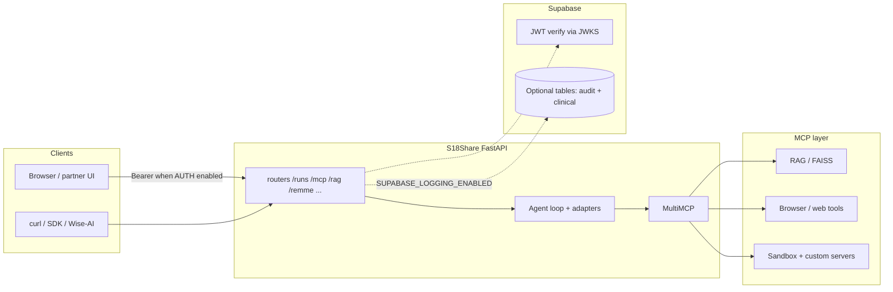

# S18Share

**Agentic AI** – A FastAPI backend for AI agents with memory, RAG, MCP servers, scheduled jobs, and a skills system.

- **Python:** 3.11+
- **Version:** 0.2.0

## The magic moment (under 30 seconds)

**One sentence:** Send a natural-language job to **`POST /runs`**, and S18 orchestrates an **agent loop** that can call **REMME memory**, **RAG**, and **MCP tools** (browser, sandbox, custom servers) behind one canonical contract—optionally **verified by Supabase JWT** and **audited to Supabase tables**.

**Proof in three steps:** `uv sync` → put `GEMINI_API_KEY` in `.env` → `uv run python api.py` → open **`/docs`** and execute **`POST /runs`** with `{"query": "…"}`. You will see a run id and the pipeline come alive without wiring a separate orchestration framework.

**Go deeper in five minutes:** [docs/QUICKSTART_5_MIN.md](docs/QUICKSTART_5_MIN.md) (git clone → running agent, Swagger UI as the built-in front end).

## Architecture at a glance

S18 is not “a single LLM route.” The **FastAPI routers** (`/runs`, `/mcp`, `/rag`, `/remme`, …) sit in front of an **agent loop** and a **MultiMCP** layer that spawns and talks to **stdio MCP servers**. **Supabase** is the trust boundary (JWT via JWKS) and optional persistence—not a stand-in for the orchestration core.



## Start Here

If you are new to this repo, use this sequence:

1. **Install deps:** `uv sync`
2. **Set env:** copy `.env.example` to `.env`, then set `GEMINI_API_KEY`
3. **Run API:** `uv run python api.py`
4. **Verify:** open `http://localhost:8000/health` and `http://localhost:8000/docs`
5. **Run a canonical workflow:** `POST /runs` with optional integration metadata (see [5-minute quickstart](docs/QUICKSTART_5_MIN.md) for the shortest path)

Key docs for common tasks:

- **Run contract and adapter architecture:** `integrations/contracts.py`, `integrations/adapters/*`
- **Settings and runtime overrides:** `config/settings.json`, `config/settings_loader.py`
- **Wise-AI integration details:** [Wise-AI Integration Sync](#wise-ai-integration-sync-mar-2026)
- **Docker + monitoring:** [Docker](#docker), [Monitoring (Dev + Staging Baseline)](#monitoring-dev--staging-baseline)

## Audience Paths

### Developer quickstart

Use this path if you want to run code and ship features quickly.

1. Follow [Quick start](#quick-start) (deps, env, run API).
2. Send a run request using [Workflow-agnostic integrations](#workflow-agnostic-integrations-apr-2026).
3. Use [Project structure](#project-structure) to find where to change code.
4. Validate with tests in `tests/` and scripts in `scripts/`.

Primary files:

- `integrations/contracts.py`
- `integrations/adapters/*`
- `routers/runs.py`
- `config/settings_loader.py`

### Platform/operator

Use this path if you manage deployment, runtime reliability, and observability.

1. Start with [Docker](#docker) for local/staging orchestration.
2. Configure metrics/alerts via [Monitoring (Dev + Staging Baseline)](#monitoring-dev--staging-baseline).
3. Review runtime behavior in [Configuration](#configuration) (`config/settings*.json`).
4. Track auth/logging posture in [Quick start](#quick-start) -> Supabase integration contract.

Primary files:

- `docker-compose.yml`
- `monitoring/docker-compose.monitoring.yml`
- `monitoring/prometheus/`
- `config/settings.json`

### Integration partner (wise-ai)

Use this path if you are integrating S18 with wise-ai workflows/endpoints.

1. Read [Wise-AI Integration Sync (Mar 2026)](#wise-ai-integration-sync-mar-2026).
2. Set `WISE_MOCKEHR_BASE_URL` and verify endpoint reachability.
3. Send canonical `POST /runs` payloads with `integration_id=wiseai`, `workflow_id=cdss`.
4. Run the cross-stack verification commands in the Wise-AI section.

Primary files:

- `integrations/adapters/wiseai.py`
- `config/integrations/wiseai_cdss_v1.json`
- `tests/integrations/`

## Document Map

- [The magic moment (under 30 seconds)](#the-magic-moment-under-30-seconds)
- [Architecture at a glance](#architecture-at-a-glance)
- [5-minute quickstart](docs/QUICKSTART_5_MIN.md)
- [Start Here](#start-here)
- [Audience Paths](#audience-paths)
- [Developer quickstart](#developer-quickstart)
- [Platform/operator](#platformoperator)
- [Integration partner (wise-ai)](#integration-partner-wise-ai)
- [Workflow-agnostic integrations (Apr 2026)](#workflow-agnostic-integrations-apr-2026)
- [Features](#features)
- [Quick start](#quick-start)
- [Docker](#docker)
- [Monitoring (Dev + Staging Baseline)](#monitoring-dev--staging-baseline)
- [Project structure](#project-structure)
- [Configuration](#configuration)
- [Wise-AI Integration Sync (Mar 2026)](#wise-ai-integration-sync-mar-2026)
- [License](#license)

## Workflow-agnostic integrations (Apr 2026)

S18Share is designed to **decouple external product/workflow specifics from the orchestration core**. Ingress requests are normalized into a **canonical run contract**, then routed through an **integration adapter** selected by `integration_id` (or `source_system` fallback).

- **Canonical contract models:** `integrations/contracts.py`
- **Adapter interface + implementations:** `integrations/base.py`, `integrations/adapters/*`
- **Adapter registry + backward-compatible aliases:** `integrations/registry.py`
- **Config-driven integration profiles:** `config/integrations/*.json` (example: `wiseai_cdss_v1.json`)
- **Architecture deep-dive:** `docs/architecture/S18_WORKFLOW_AGNOSTIC_TARGET.md`

### Quick start: run with canonical metadata

`POST /runs` accepts optional integration metadata. If omitted, S18 falls back to the `default` adapter (`integration_id=default`, `workflow_id=generic`, `contract_version=v1`).

```bash
curl -X POST "http://localhost:8000/runs" \
  -H "Authorization: Bearer <supabase_access_token>" \
  -H "Content-Type: application/json" \
  -d '{
    "query": "interpret CBC and suggest next steps",
    "integration_id": "wiseai",
    "workflow_id": "cdss",
    "contract_version": "v1",
    "source_system": "wiseai",
    "external_event_id": "evt_123",
    "consent_ref": "consent_abc",
    "raw_payload": {"hemoglobin": 12.1, "wbc": 7.5, "platelets": 220}
  }'
```

### Add a new integration (high level)

- Implement an adapter in `integrations/adapters/<your_integration>.py` (map **raw → canonical**, and **canonical result → response envelope**).
- Add a profile `config/integrations/<integration>_<workflow>_<version>.json` for risk/response profiles and field aliases.
- Add contract/registry/adapter tests under `tests/integrations/`.

### Tenancy baseline (Starter default, Growth-ready routing)

- Default tier is `starter` (shared-schema style) and is configured under `config/settings*.json` -> `tenancy`.
- `POST /runs` accepts optional `tenant_id`, `tenant_tier`, and `data_region`.
- If omitted, S18 applies defaults (`tenant_id=default`, `tenant_tier=starter`, `data_region=in`).
- Growth migration hook is pre-wired via `tenancy.growth_routing_enabled` so selected healthcare tenants can be routed to isolated infrastructure later without changing request contracts.

## Features

- **Agent loop** – Multi-step planning and execution with retries and circuit breakers
- **REMME (Remember Me)** – User memory and preferences: extraction, staging, normalizer, belief updates, and hubs (Preferences, Operating Context, Soft Identity). See [remme/ARCHITECTURE.md](remme/ARCHITECTURE.md).
- **GBrain memory bridge (optional)** – Interop layer that can mirror REMME memories/hubs into GBrain pages (dual-write) and optionally cut reads over to the bridge. See `docs/architecture/GBRAIN_COMPATIBILITY.md`.
- **RAG** – Document indexing and search (FAISS + optional BM25), chunking, and ingestion
- **MCP servers** – RAG, browser, sandbox, and configurable external servers
- **Scheduler** – Cron-style jobs with skill routing (e.g. Market Analyst, System Monitor, Web Clipper) and inbox integration
- **Skills** – Pluggable skills with intent matching and run/success hooks
- **Streaming** – SSE endpoint for real-time events from the event bus
- **Config** – Centralized settings in `config/` (Ollama, models, RAG, agent, REMME)

---

## Quick start

### 1. Install dependencies

Using [uv](https://github.com/astral-sh/uv):

```bash
uv sync
```

Or with pip:

```bash
pip install -e .
```

### 2. Environment variables

| Variable | Purpose |
| --- | --- |
| `GEMINI_API_KEY` | Google Gemini API key (used for agents, apps, and some MCP tools when configured) |
| `AUTH_ENABLED` | Enable backend bearer-token verification (`true`/`false`) |
| `S18_AUTH_ENABLED` | Docker-only override mapped to `AUTH_ENABLED` for this service (prevents cross-repo env collisions) |
| `SUPABASE_URL` | Supabase project URL (used for auth verify and optional logging) |
| `SUPABASE_ANON_KEY` | Supabase anon key (optional for frontend/public client flows) |
| `SUPABASE_JWT_AUDIENCE` | Expected access-token `aud` claim for backend verification (default `authenticated`) |
| `SUPABASE_LOGGING_ENABLED` | Enable request/result persistence to Supabase tables (`true`/`false`) |
| `SUPABASE_SERVICE_ROLE_KEY` | Service role key for backend writes to Supabase tables |

Optional:

- **Ollama** – Default config points to `http://127.0.0.1:11434`. Run [Ollama](https://ollama.ai) locally for embedding, semantic chunking, and optional agent overrides.
- **Git** – Required for GitHub explorer features; the API will warn at startup if Git is not found.
- **WISE_MOCKEHR_BASE_URL** – Base URL of the wise-ai Mock EHR API. When set, the EHRDataMinerAgent's mockehr MCP fetches `/patients/{id}` and `/patients/{id}/labs` from wise-ai for end-to-end integration. Examples: `http://localhost:8000` (wise-ai on host), `http://backend:8000` (typical Compose service name on the shared network). Match the URL to how you run wise-ai, not only to Docker.

### Supabase integration contract (S18)

- Frontend/S18 performs login with Supabase Auth and sends `Authorization: Bearer <access_token>`.
- Backend verifies the JWT on protected endpoints using Supabase JWKS (`/auth/v1/.well-known/jwks.json`) with issuer/audience checks (no backend-managed Supabase session).
- If S18 is called through another backend/proxy, it also accepts `X-Forwarded-Authorization: Bearer <access_token>`.
- Optional persistence can write to two Supabase tables:
  - `ehr_request_log` (inbound request/audit trail)
  - `ehr_clinical_result` (normalized RAC/CBC/ABDM/FHIR-aligned outcome)
- Reference SQL schema: `docs/supabase_ehr_schema.sql`
- Quick environment/table readiness check:

```bash
python scripts/check_supabase_integration.py
```

### 3. Run the API

```bash
uv run python api.py
```

Or:

```bash
uv run uvicorn api:app --host 0.0.0.0 --port 8000 --reload
```

- **API:** [http://localhost:8000](http://localhost:8000)  
- **Health:** [http://localhost:8000/health](http://localhost:8000/health)  
- **Docs:** [http://localhost:8000/docs](http://localhost:8000/docs)  

The app expects a frontend at `http://localhost:5173` (CORS is configured for it).

---

## Docker

### 1. Prepare environment file

```bash
cp .env.example .env
```

PowerShell:

```powershell
Copy-Item .env.example .env
```

Set `GEMINI_API_KEY` in `.env`.

### 2. Run API only (host Ollama)

Set in `.env`:

```bash
OLLAMA_BASE_URL=http://host.docker.internal:11434
```

Then:

```bash
docker compose up --build -d api
```

### 3. Run API + Ollama in Docker

Keep in `.env`:

```bash
OLLAMA_BASE_URL=http://ollama:11434
```

Then:

```bash
docker compose up --build -d
```

### 4. Verify (Docker mapping)

- API: [http://localhost:8001](http://localhost:8001)
- Health: [http://localhost:8001/health](http://localhost:8001/health)
- Docs: [http://localhost:8001/docs](http://localhost:8001/docs)
- Prometheus scrape: [http://localhost:8001/metrics/prometheus](http://localhost:8001/metrics/prometheus)

Persistent state is stored on host-mounted folders:

- `data/`
- `memory/`
- `config/`
- `mcp_servers/faiss_index/`

---

## Monitoring (Dev + Staging Baseline)

Monitoring assets are in `monitoring/` and run as an additive stack:

- Prometheus config/rules: `monitoring/prometheus/`
- Alertmanager config: `monitoring/alertmanager/`
- Grafana provisioning/dashboard: `monitoring/grafana/`

### Start API + Monitoring

```bash
docker compose up --build -d api
docker compose -f monitoring/docker-compose.monitoring.yml up -d
```

If you want local Ollama in Docker too:

```bash
docker compose up --build -d
docker compose -f monitoring/docker-compose.monitoring.yml up -d
```

### Validate Monitoring

- Prometheus target page: [http://localhost:9090/targets](http://localhost:9090/targets)
- Alertmanager: [http://localhost:9093](http://localhost:9093)
- Grafana: [http://localhost:3000](http://localhost:3000) (`admin` / `admin`)

Expected key metric families:

- `wiseai_api_requests_total`
- `wiseai_api_requests_success_total`
- `wiseai_api_request_latency_ms`
- `wiseai_orchestrator_runs_total`
- `wiseai_orchestrator_run_latency_ms`
- `wiseai_rag_requests_total`
- `wiseai_mcp_tool_calls_total`
- `wiseai_memory_operations_total`

### Port Overrides

If local ports conflict, override host mappings in `monitoring/docker-compose.monitoring.yml`:

- Prometheus: `9090`
- Alertmanager: `9093`
- Grafana: `3000`

---

### CI Docker target

This repo now includes a dedicated Docker build target for CI:

```bash
docker build --target ci -t s18share-ci .
docker run --rm s18share-ci
```

The CI target uses pinned dependencies from `requirements-ci.txt` (exported from `uv.lock`) and runs a quick compile sanity check.

---

## Project structure

| Path | Description |
| ---- | ----------- |
| `api.py` | FastAPI app, lifespan, CORS, router includes |
| `core/` | Agent loop, scheduler, event bus, circuit breaker, persistence, model manager, skills |
| `remme/` | Memory and preferences pipeline (extractor, store, hubs, normalizer) |
| `routers/` | API routes: RAG, remme, agent, chat, runs, stream, cron, skills, inbox, etc. |
| `mcp_servers/` | MCP server implementations (RAG, browser, sandbox, multi_mcp) |
| `config/` | Settings loader, `settings.json`, `settings.defaults.json`, agent config |
| `data/` | Inbox DB, system jobs/snapshot, RAG documents |
| `memory/` | Execution context, remme index, debug logs |
| `agents/` | Agent runner and config-driven agents |
| `scripts/` | Utility and test scripts |
| `tests/` | Verification and integration-style tests |

---

## Configuration

- **Main settings:** `config/settings.json` (created from `config/settings.defaults.json` if missing).
- **Agent prompts and MCP:** `config/agent_config.yaml`.
- **REMME extraction prompt and options:** under `remme` in settings.
- **GBrain bridge flags:** under `remme.gbrain` in `config/settings.defaults.json`:
  - `enabled`, `dual_write`, `read_from_bridge`, `mirror_dir`, `server_id`

### GBrain bridge setup (optional)

GBrain runs Bun-first and can be wired as an MCP server (stdio). For the implemented mapping model and rollout plan, see `docs/architecture/GBRAIN_COMPATIBILITY.md`.

One-time local setup (from repo root):

```bash
git clone https://github.com/garrytan/gbrain.git gbrain
cd gbrain && bun install && bun run src/cli.ts init && cd ..
```

Verify MCP registration:

```bash
uv run python scripts/test_gbrain_mcp_registration.py
uv run python scripts/test_gbrain_mcp_live.py
```

---

## Wise-AI Integration Sync (Mar 2026)

This section is a cross-repo integration reference. If you are onboarding to S18 itself, start with [Start Here](#start-here) and [Quick start](#quick-start).

### Integration-focused technical changes completed

- **MockEHR + Wise adapter path** - Wise-side MockEHR adapter and S18-compatible tool stubs were integrated for cross-repo interoperability, with S18 consuming MockEHR data through MCP flows.
- **CBC schema hardening** - Added Pydantic clinical schema validation and follow-up fixes for CBC unit normalization and stable fast/full CDSS payload handling.
- **MCP routing/tool-calling robustness** - Improved MCP routing, timeout handling, retry/error behavior, and agent alias support for more reliable tool execution.
- **Supabase integration touchpoints** - Added/expanded Supabase-backed auth verification and optional request/result logging paths used by S18 integration flows.

### Capstone issue-sync status (Wise-AI + S18 reconciliation)

- **Closed as implemented** - `#69`, `#127`, `#128`
- **Progress-updated and intentionally open** - `#67`, `#73`, `#129`, `#130`, `#156`, `#202`, `#205`, `#206`
- **Kept open for future/compliance stage** - `#155`, `#210`, `#211`, and `#183+`
- Detailed matrix and evidence links: `docs/governance/WISE_S18_issue_reconciliation_2026-03-17.md`

### Fresh architecture reference (latest)

- **Canonical (Mar 2026 sync)** - `docs/architecture/WISE_AI_CDSS_Architecture_2026-03.md`
- **Previous conceptual baseline** - `docs/architecture/WISE_AI_CDSS_Architecture.md` in wise-ai/TSAI-EAG-Capstone

### Full stack with wise-ai

Set **`WISE_MOCKEHR_BASE_URL`** to the base URL of the wise-ai FastAPI app (Mock EHR). Use whatever host and port actually serve that API—for example `http://localhost:8000` when wise-ai runs on your machine, or a Compose service URL such as `http://backend:8000` when both stacks share a Docker network. The integration is the same whether wise-ai is started with `uvicorn`, Docker, or another wrapper, as long as S18 can reach the URL.

For **Docker Compose** flows that run wise-ai together with S18 (local builds, images from GHCR, or the full-stack compose file), see the wise-ai repo: **[`deployment/docker/README.md`](https://github.com/wiseaihub/TSAI-EAG-Capstone/tree/main/deployment/docker)** — use the **Build and run locally**, **Run from GitHub Container Registry**, and **Full stack (wise-ai + S18Share)** subsections as needed.

### Quick verification (local)

Run API:

```bash
uv run python api.py
```

Run targeted integration tests:

```bash
uv run pytest tests/test_mockehr_mcp.py tests/test_clinical_schema.py test_e2e.py
```

Optional Supabase readiness check:

```bash
python scripts/check_supabase_integration.py
```

---

## License

See repository or project metadata for license information.
