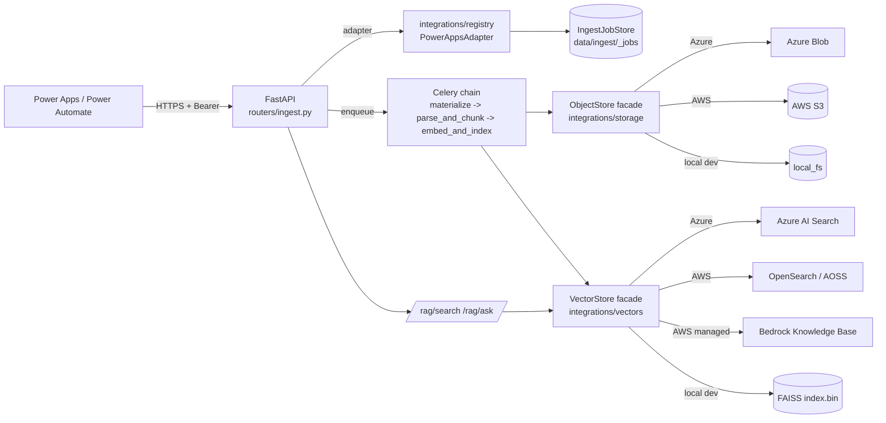
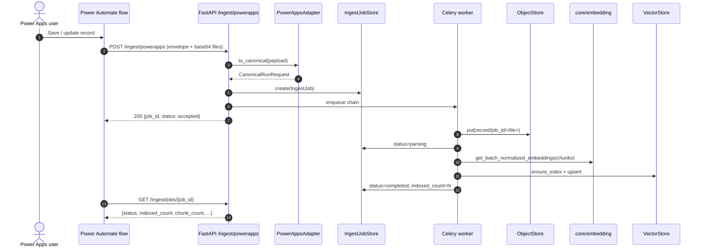

# Power Apps -> Cloud RAG ingest pipeline

> Architecture for ingesting data from Microsoft Power Apps into the S18
> RAG stack with a cloud-agnostic abstraction over Azure (Blob + AI Search +
> Azure OpenAI) and AWS (S3 + OpenSearch / Bedrock KB + Bedrock embeddings).

## 1. Goals

1. **Single API surface** for Power Automate / Power Apps regardless of cloud.
2. **Cloud routing per tenant**, not per binary build. Switching a tenant
   from Azure to AWS is a JSON config change, never a redeploy.
3. **Reuse existing S18 plumbing**: `IntegrationAdapter` contract, tenancy
   resolution, Celery executor, Prometheus metrics, Supabase auth.
4. **No SDK is required for clouds you do not use** (lazy imports, optional
   dependencies).

## 2. End-to-end flow



## 3. Component map

| Concern | Code | Notes |
| ------- | ---- | ----- |
| HTTP entrypoints | [`routers/ingest.py`](../../routers/ingest.py) | `/ingest/powerapps`, `/ingest/powerapps/files`, `/ingest/jobs/{id}`, `/ingest/health` |
| Integration adapter | [`integrations/adapters/powerapps.py`](../../integrations/adapters/powerapps.py) | Maps Power Automate envelopes -> `CanonicalRunRequest` |
| Profile | [`config/integrations/powerapps_generic_v1.json`](../../config/integrations/powerapps_generic_v1.json) | Per-tenant cloud + chunking overrides |
| Object storage facade | [`integrations/storage/`](../../integrations/storage/) | `ObjectStore` Protocol + `local_fs`, `azure_blob`, `aws_s3` backends |
| Vector store facade | [`integrations/vectors/`](../../integrations/vectors/) | `VectorStore` Protocol + `faiss`, `azure_ai_search`, `aws_opensearch`, `bedrock_kb` |
| Pipeline helpers | [`integrations/ingest/pipeline.py`](../../integrations/ingest/pipeline.py) | Chunking, parsing, record materialization |
| Jobs ledger | [`integrations/ingest/jobs.py`](../../integrations/ingest/jobs.py) | File-backed by default, swap for Supabase / DynamoDB / Cosmos by subclassing |
| Celery tasks | [`workers/ingest_tasks.py`](../../workers/ingest_tasks.py) | `materialize` / `parse_and_chunk` / `embed_and_index` |
| Embeddings | [`core/embedding.py`](../../core/embedding.py) | Ollama / Azure OpenAI / Bedrock providers |
| RAG read path | [`routers/rag.py`](../../routers/rag.py) | Routes to cloud `VectorStore` when tenant is configured for one |

## 4. Tenancy & data isolation

`integrations/tenancy.storage_namespace_for_tenant(...)` is the only
function that decides what folder/container/index a tenant lives in.
Both facades call it, so:

- Local dev: `data/ingest/<namespace>/...` and
  `mcp_servers/faiss_index/<namespace>/...`
- Azure: blob path prefix is `<namespace>/`; AI Search index name is
  `s18-rag-<namespace>`.
- AWS: S3 key prefix is `<namespace>/`; OpenSearch index is `s18-rag-<namespace>`.

Tenant-tier overrides in `ingest.object_store.tenant_overrides` and
`ingest.vector_store.tenant_overrides` let an `enterprise-health` customer
sit on Azure while everyone else stays on the default.

## 5. Sequence: a Dataverse row arrives



## 6. Configuration surface

`config/settings.defaults.json` carries the entire facade configuration
under `ingest`:

```json
{
  "ingest": {
    "object_store": {
      "provider": "local_fs",
      "azure_blob": {"account_url": "", "container": ""},
      "aws_s3": {"bucket": "", "region": "us-east-1"},
      "tenant_overrides": {}
    },
    "vector_store": {
      "provider": "faiss",
      "azure_ai_search": {"endpoint": "", "index_name": ""},
      "aws_opensearch": {"endpoint": "", "region": "us-east-1"},
      "bedrock_kb": {"knowledge_base_id": "", "data_source_id": ""},
      "tenant_overrides": {}
    }
  }
}
```

Per-tenant cloud routing examples:

```json
{
  "ingest": {
    "object_store": {
      "provider": "local_fs",
      "tenant_overrides": {
        "acme-health": "azure_blob",
        "globex-aws": "aws_s3"
      }
    },
    "vector_store": {
      "provider": "faiss",
      "tenant_overrides": {
        "acme-health": "azure_ai_search",
        "globex-aws": "aws_opensearch"
      }
    }
  }
}
```

Secrets stay in env vars; see [`.env.example`](../../.env.example) and the
`*_env` keys in the JSON config (e.g. `sas_token_env`,
`connection_string_env`).

## 7. Power Apps integration

See [`docs/integrations/powerapps/README.md`](../integrations/powerapps/README.md)
for:

- the OpenAPI 2.0 spec used to register the **S18 RAG Ingest** custom connector,
- a reference Power Automate flow for Dataverse row create/update,
- a reference Power Automate flow for SharePoint document upload.

## 8. IaC outline

The repo deliberately leaves IaC declarative-only (the application is
cloud-agnostic, the deployer brings their own Terraform / CDK). Minimum
resources required per tenant:

### Azure path

- Storage account + private container; Customer-Managed Key on the account.
- Azure AI Search service (Basic+); private endpoint recommended.
- Azure OpenAI deployment for embedding model.
- Managed Identity assigned to the API + worker pods with
  `Storage Blob Data Contributor` and `Search Index Data Contributor`.

### AWS path

- S3 bucket with SSE-KMS, Bucket Key on, default deny via bucket policy.
- OpenSearch Serverless collection (`vectorsearch` type) **or** a Bedrock
  Knowledge Base with this S3 bucket as a data source.
- IAM role for the Celery worker with
  `s3:GetObject/PutObject`, `aoss:APIAccessAll`, `bedrock:InvokeModel`,
  `bedrock-agent-runtime:Retrieve`.
- VPC endpoints for S3 + Bedrock when running inside a private subnet.

## 9. Security & compliance hooks

- All endpoints require Supabase JWT (`require_supabase_user`).
- Power Automate authenticates via Entra ID OAuth on the custom connector;
  the connector either passes through that bearer or exchanges it for an
  S18-scoped token via `idempotency_key + consent_ref` carried on the
  envelope.
- `ObjectRef.metadata` always carries `tenant_id`, `integration_id`, and
  the SHA-256 of the original bytes, enabling audit replay without
  recomputation.
- The Bedrock Knowledge Base path lets fully managed RAG run without S18
  ever computing embeddings; useful for healthcare clouds that mandate
  Bedrock-managed inference for HIPAA / data residency.

## 10. Out of scope (for this iteration)

- Streaming Power Apps deletes back into the vector store. Use
  `VectorStore.delete_by_doc(doc_id)` from a delete flow when needed.
- Cross-cloud federation (a single tenant searching both Azure AI Search
  and OpenSearch). The facade is per-tenant single-target.
- Auto-tuning chunk size per content type. Profiles ship a single
  `chunk.size` / `chunk.overlap` knob today.
