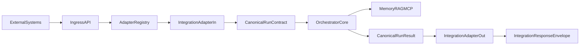

# S18 Workflow-Agnostic Target Architecture

## Objective

Decouple external product/workflow specifics from S18 execution internals so new integrations can be onboarded via adapters and config, without changing orchestration core behavior.

## Design Principles

1. **Contract-first ingress**: all incoming requests are normalized into a canonical run contract.
2. **Adapter boundary**: integration-specific parsing/formatting lives in dedicated adapter modules.
3. **Core isolation**: `routers/`, `core/`, `agents/`, `mcp_servers/`, and memory systems consume canonical fields only.
4. **Config-driven policy**: workflow policy and mappings are loaded from versioned config profiles.
5. **Traceability**: every run propagates integration and contract metadata through logs, metrics, and outputs.

## Current-to-Target Mapping

### Current coupling hotspots

- `routers/runs.py`: request schema and run lifecycle currently mix generic execution concerns with source-specific metadata.
- `agents/base_agent.py`: WISE-oriented extraction/normalization helpers are embedded in the generic runner path.
- `core/loop.py`: receives run inputs that can carry integration-shaped payload assumptions.
- `mcp_servers/multi_mcp.py`: call path has no standard integration metadata envelope for consistent observability.

### Target boundaries

- **Ingress API**: only parses transport, delegates all semantic normalization to adapter-in.
- **Integration Adapter-In**: converts external payload into canonical contract.
- **Canonical Contract**: single normalized input/output context for core execution.
- **Orchestrator Core**: unchanged decision and execution logic, now strictly contract-based.
- **Integration Adapter-Out**: converts canonical result into integration-specific response envelope.

## Canonical Run Contract (v1)

```json
{
  "contract_version": "v1",
  "integration_id": "wiseai",
  "workflow_id": "cdss",
  "query": "interpret CBC and suggest next steps",
  "model": "gemini-2.5-flash",
  "session": {
    "run_id": "1744836824123",
    "external_event_id": "evt_123",
    "idempotency_key": "hash-key"
  },
  "policy": {
    "risk_profile": "clinical_default",
    "response_profile": "wise_cbc_v1"
  },
  "payload": {
    "clinical": {},
    "documents": [],
    "context": {}
  },
  "audit": {
    "source_system": "wiseai",
    "consent_ref": "consent_abc"
  }
}
```

### Required fields

- `contract_version`
- `integration_id`
- `workflow_id`
- `query`

### Optional fields

- `model`
- `session.*`
- `policy.*`
- `payload.*`
- `audit.*`

## Adapter Interfaces

Create an `integrations/` package with these interfaces:

- `integrations/contracts.py`
  - dataclasses / pydantic models for canonical request and response envelopes
- `integrations/base.py`
  - `class IntegrationAdapter(Protocol)`
  - `to_canonical(raw_request: dict) -> CanonicalRunRequest`
  - `from_canonical(run_result: dict, context: CanonicalRunRequest) -> dict`
- `integrations/registry.py`
  - adapter resolution by `integration_id` (or source fallback)
  - default adapter for unknown integrations
- `integrations/adapters/wiseai.py`
  - WiseAI mapping logic (current behavior parity)
- `integrations/adapters/default.py`
  - generic passthrough mapping for internal/testing clients

## Runtime Flow



## File-Level Implementation Plan

### 1) Ingress normalization

- `routers/runs.py`
  - extend `RunRequest` to include `integration_id`, `workflow_id`, and `contract_version`.
  - resolve adapter from registry.
  - normalize request before calling `AgentLoop4`.
  - include canonical metadata in logs and persisted run records.

### 2) Core boundary hardening

- `core/loop.py`
  - accept canonical run context and avoid direct integration-specific branching.
- `agents/base_agent.py`
  - move WISE-specific extraction helpers to integration adapter utility modules.
  - keep runner generic and policy-driven.
- `shared/state.py`
  - expose shared adapter registry singleton (if needed for dependency injection).

### 3) MCP and memory metadata propagation

- `mcp_servers/multi_mcp.py`
  - pass `integration_id`, `workflow_id`, `contract_version` in tool call metadata for tracing.
- `remme/store.py`
  - optionally annotate memory entries with integration/workflow tags.
- `remme/gbrain_bridge.py`
  - preserve canonical metadata in bridge writes where appropriate.

## Migration Strategy

### Phase 1: Wise parity via adapter (no behavior change)

- Implement `wiseai` adapter using existing field semantics.
- Route Wise requests through adapter registry.
- Verify responses are shape-compatible with current clients.

### Phase 2: MockEHR and generic adapter onboarding

- Introduce `mockehr` adapter and default fallback adapter.
- Keep one canonical orchestration path; expand adapters only.

### Phase 3: De-couple legacy integration logic

- Remove or isolate integration-specific helper logic from core/agents/router.
- Keep policy in config profiles under `config/integrations/*.json`.

## Validation Matrix

### Contract tests

- `tests/integrations/test_contracts.py`
  - validate required canonical fields and defaults.
- `tests/integrations/test_registry.py`
  - adapter selection rules and fallback behavior.
- `tests/integrations/test_wiseai_adapter.py`
  - verify current Wise payloads map to canonical contract correctly.

### Regression tests

- Existing path compatibility:
  - `tests/test_mockehr_mcp.py`
  - run router-level tests for existing `/runs` behavior.
- Add run invariants:
  - same run success/failure semantics
  - same idempotency handling
  - same auth/logging behavior with additional metadata tags

### Non-functional checks

- Metrics labels include `integration_id`, `workflow_id`, `contract_version`.
- MCP call traces retain integration metadata.
- Backward compatibility for clients that omit `integration_id` (default adapter path).

## Acceptance Criteria

1. A new integration can be added by implementing adapter-in and adapter-out plus config profile.
2. `routers/runs.py` is contract-first and only contains adapter selection logic (no integration-specific branching).
3. Core loop and agent runner consume canonical contract fields only.
4. Observability can segment reliability/latency by integration and workflow.
