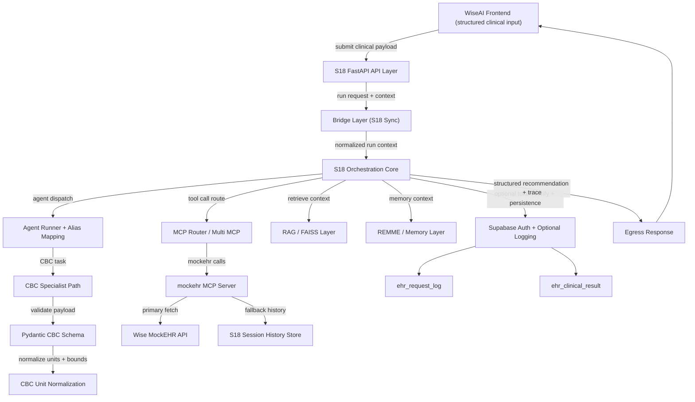

# WISE AI + S18 CDSS Architecture (Mar 2026 Sync)

## Purpose

This document is the current architecture baseline for the Wise-AI and S18 integration path.
It reflects the latest implementation state in this repository, including MockEHR bridge
integration, CBC schema hardening, MCP routing robustness, and Supabase-backed auth/logging paths.

**Model routing (Gemma vs MedGemma for Wise-only Ollama runs):** see [`docs/wise_ai_models.md`](../wise_ai_models.md).

## System data flow

The system follows a decoupled Orchestrator-Agent pattern with explicit data contracts.

1. **Ingress layer (WiseAI frontend)**
   - Captures structured clinical data from the UI.
   - Performs basic field validation before API submission.

2. **Bridge layer (S18 sync)**
   - Handles state handoff between frontend/web gateway calls and S18 run execution.
   - Routes integration requests into orchestrated agent runs.

3. **Orchestration core (S18)**
   - Runs planning/execution loop and chooses specialist agents/tools based on context.
   - Normalizes planner aliases to runtime agents for stable execution.

4. **Specialist layer (CBC agent path)**
   - Uses Pydantic validation to enforce CBC schema and physiological safety boundaries.
   - Normalizes unit scales and stabilizes fast/full CDSS payload behavior.

5. **Egress layer**
   - Returns structured recommendations with traceable reasoning fields.
   - Supports optional persistence/audit paths for downstream review.

## Key engineering enhancements (latest delta)

- **Stateful sync bridge**: reinforced Wise-AI to S18 bridge behavior for real-time request flows.
- **Clinical data contracts**: Pydantic-based CBC schema validation in core clinical schema path.
- **Unit normalization middleware**: automatic medical unit normalization to reduce downstream inference errors.
- **MockEHR bridge hardening**: S18 `mockehr` MCP server integration with Wise MockEHR API fallback strategy.
- **MCP routing robustness**: improved routing, timeout, retry, and tool-call reliability.
- **Auth/logging integration**: Supabase token verification and optional request/result persistence.
- **Issue lifecycle hygiene**: tracked through GitHub issues with ongoing reconciliation.

## Implementation mapping (current repo)

- Agent orchestration and WISE alias/output compatibility: `agents/base_agent.py`
- CBC schema validation and normalization: `core/schemas/clinical.py`
- MockEHR MCP + Wise API bridge: `mcp_servers/server_mockehr.py`
- Runtime service topology/network: `docker-compose.yml`
- Supabase integration contract and env details: `README.md` + `docs/supabase_ehr_schema.sql`

## Architecture diagram (Mermaid source)

## Notes

- This file supersedes the older conceptual architecture narrative for integration-specific discussions.
- Keep this doc aligned with implementation changes in `agents/`, `core/`, and `mcp_servers/`.
