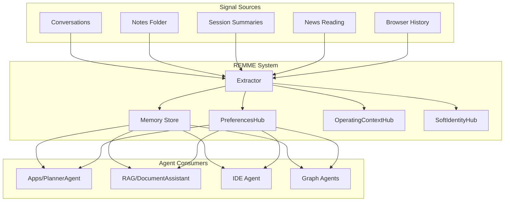
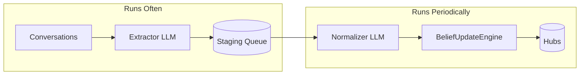

# REMME Architecture

> **REMME = "Remember Me"** - The single source of truth for user knowledge and preferences.

## Overview

REMME is the centralized system that:
1. **Collects** signals from multiple sources (conversations, notes, sessions, news, browser)
2. **Extracts** structured preferences using LLM
3. **Stores** both unstructured memories (for RAG recall) and structured hubs (for agent injection)
4. **Serves** all agents (Apps, RAG, IDE, RUNS) with user context



---

## Module Structure

All REMME code resides in `/remme/`:

```
remme/
├── __init__.py           # Public API
├── extractor.py          # LLM-based extraction (conversations, notes)
├── store.py              # FAISS vector store for memory snippets
├── preferences.py        # Structured preference injection
├── utils.py              # Embeddings, helpers
│
├── hubs/                 # Structured preference storage
│   ├── __init__.py
│   ├── base_hub.py       # Abstract base with persistence
│   ├── preferences_hub.py
│   ├── operating_context_hub.py
│   └── soft_identity_hub.py
│
├── schemas/              # Pydantic models for hubs
│   └── hub_schemas.py
│
└── sources/              # Signal source scanners
    ├── __init__.py
    ├── notes_scanner.py      # Scans data/Notes
    ├── session_scanner.py    # Scans session_summaries_index
    └── news_tracker.py       # (Future) Tracks news reading
```

---

## Two-LLM Pipeline

REMME uses a staged extraction pipeline for robust, flexible preference capture:



### Stage 1: Extractor (Frequent)

**Trigger:** After each conversation scan
**Output:** Free-form preferences to staging queue

```json
{"diet": "vegetarian", "blood_type": "B+", "fav_team": "CSK"}
```

The extractor doesn't need to know the hub schema - it just extracts any preference-like information.

### Stage 2: Staging Queue

**Location:** `memory/remme_staging.json`

```json
{
  "pending": [
    {"raw": {"diet": "vegetarian"}, "source": "session_123", "timestamp": "..."},
    {"raw": {"blood_type": "B+"}, "source": "manual", "timestamp": "..."}
  ],
  "last_normalized": "2026-01-15T10:00:00Z"
}
```

### Stage 3: Normalizer (Batched)

**Trigger:** Every 10 items OR every 6 hours OR manual "Sync Now"

The normalizer LLM:
1. Reads current hub schema
2. Maps extracted fields to known schema fields (diet → dietary_style)
3. Creates new fields in `extras` for unknown concepts
4. Detects conflicts and reinforcements

```json
{
  "mappings": [
    {"field": "dietary_style", "value": "vegetarian", "is_new": false},
    {"field": "extras.blood_group", "value": "B+", "is_new": true}
  ]
}
```

### Stage 4: BeliefUpdateEngine

Calculates confidence updates:
- **New belief:** Base confidence (0.3)
- **Reinforcement:** Asymptotic increase (0.3 → 0.45 → 0.55)
- **Contradiction:** Decrement + conflict resolution
- **Decay:** Time-based reduction for stale beliefs

### Stage 5: Hubs (Persistence)

Final structured storage with confidence scores:

```json
{
  "dietary_style": {"value": "vegetarian", "confidence": 0.55, "evidence_count": 3},
  "extras": {
    "blood_group": {"value": "B+", "confidence": 0.3, "evidence_count": 1}
  }
}
```

---

## Signal Sources

### Currently Implemented
- ✅ **Conversations** - Via session smart scan

### To Be Implemented
- ❌ **Notes** - Scan `data/Notes/*.md`
- ❌ **Session Summaries** - Direct scan of `memory/session_summaries_index`
- ❌ **News** - Track articles read in NEWS tab
- ❌ **Browser** - (Future) External browser history

---

## Agent Injection

At runtime, agents receive REMME context:

```python
def get_remme_context(query: str) -> str:
    """
    Build context string for agent system prompt.
    """
    # 1. Semantic search for relevant memories
    memories = remme_store.search(query, k=5)
    
    # 2. Get structured preferences
    prefs = get_preferences_for_injection()
    
    return f"""
USER MEMORIES:
{format_memories(memories)}

USER PREFERENCES:
- Verbosity: {prefs['verbosity']}
- Dietary: {prefs['dietary_style']}
- Tech Stack: {prefs['languages']}, {prefs['frameworks']}
- Communication: {prefs['tone']}, humor={prefs['humor_tolerance']}
"""
```

---

## Frontend Integration

The **Preferences** tab in REMME panel shows:
- All extracted preferences from hubs
- Evidence count and confidence scores
- Bootstrap button for manual re-extraction
- Edit/delete controls for user transparency

---

## Key Design Decisions

1. **Single Source** - REMME is the only system that stores user knowledge
2. **Hubs Inside REMME** - Not a separate UserModel module
3. **Dual Output** - Both memories (text) and preferences (structured)
4. **All Agents Consume** - Apps, RAG, IDE, RUNS all get REMME context
5. **User Control** - Transparent extraction with edit/delete capabilities
